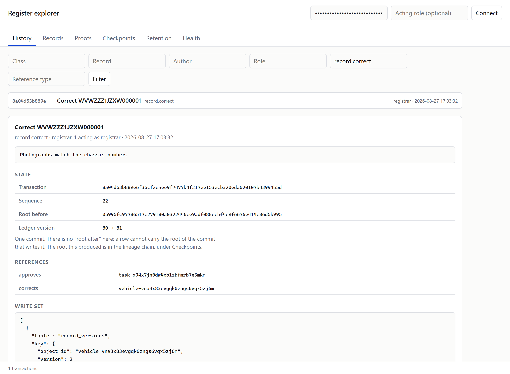
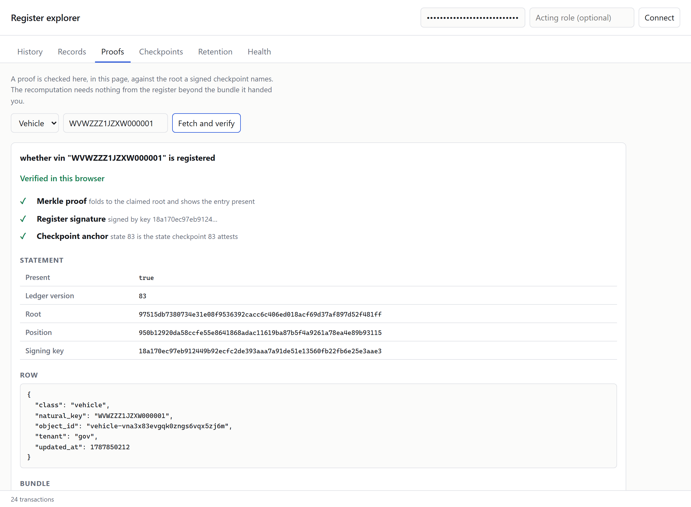
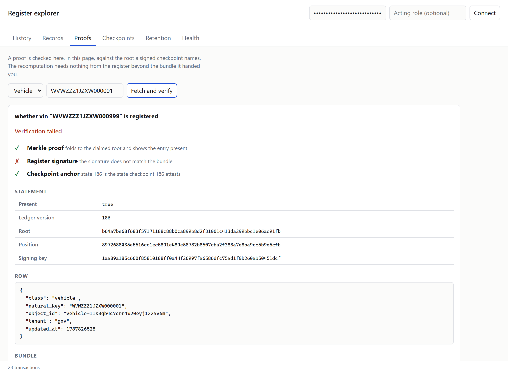

# container-app-register

A schema-driven, tamper-evident register of records, running as a
confidential container on Privasys
[`enclave-os-virtual`](https://docs.privasys.org/solutions/enclave-os/).

A register is not a database with an audit table bolted on. It is a
system whose answer to "what does this record say" has to be
accompanied by "and here is why you should believe nobody changed it
behind your back". This one keeps every record version and every
governance event in
[immutable-ledger](https://github.com/Privasys/immutable-ledger), an
authenticated key-value store whose single 32-byte root attests the
whole database, and it signs that root periodically so a customer can
hold the evidence outside the register that produced it.

The generic core knows nothing about any particular domain. What a
register holds, who may do what to it, and under which procedure, is
declared in a **pack**. A national vehicle register ships as the
reference pack, and the test suite drives it end to end: first
registration with a proof-of-conformity gate, a two-party ownership
transfer that settles under policy unless a lien is open, corrections
linked to what they correct, scrappage that retires the plate, a
police stolen-vehicle flag, and a data subject's erasure that leaves
the vehicle's technical history intact and provable.

## What it gives you

**Every change carries a reason.** Every state-changing operation is a
transaction with a git-like commit envelope: author, the role they were
acting under, timestamp, a required message under git conventions, and
typed links to earlier work (`corrects:`, `supersedes:`, `approves:`,
`relates:`). The envelope and the effects are hashed together into the
transaction id, so a change and its reason are one object. A
messageless transaction is refused at the API and never reaches
storage.

**Records that come with proofs.** Rows, the catalogue and the
transaction log are all ledger entries under one sparse Merkle tree.
Any record can be returned as a signed evidence bundle: the row, an
inclusion proof, the root and version it was read at, and the signed
checkpoint anchoring exactly that state. A key that is not registered
comes back with an **absence proof** — "this vehicle was never
registered here" is a statement the register can prove, not a silence.

**Query, with evidential weight.** Listing, filtering, counting,
ordering and joining run through the ledger's own SQL layer, and every
row it serves is re-read and re-verified through the ledger rather than
served from an index. The register accepts no SQL from callers: it runs
the queries its pack declared, with typed parameters substituted as
literals.

**Deletion that is lawful and provable.** Retention pruning and
data-subject erasure are signed, policy-gated transactions. A read of a
pruned version answers "pruned per policy P02", which is a different
statement from "no such version". An erasure destroys the subject's
data-encryption key, so the plaintext is gone everywhere at once,
including in backups taken before the request, while the record, its
commitments and its history stay intact and still verify. Nothing can
be *covertly* altered or deleted; deletion itself exists, and is
explicit.

**Customer-held keys and anchors.** Personal fields are encrypted under
per-subject keys, wrapped both for the running service and for a
key-encryption key the customer enrolled and holds. Signed root
checkpoints are delivered to the customer, and
[`register-verify`](cmd/register-verify) checks them with nothing but
the files and a public key — no access to the register at all.

**An auditable lineage, not just a set of states.** Every commit extends
a hash chain over the root sequence, and the chain head is itself a leaf,
so the live root commits to the entire history behind it. Each signed
checkpoint carries that head, which makes it an audit anchor rather than
a snapshot. Given two anchors and the roots between them — all public —
an auditor folds one into the other with a pure function and no key at
all. A register that rewrote its history cannot reach the anchored head:
doing so is a preimage attack.

**Attested transport.** Caddy terminates RA-TLS in front of the
service, so a client that verified the certificate has verified a
hardware quote over the measurement of the build serving it. The
register additionally publishes SHA-256 of its commitment key at OID
`1.3.6.1.4.1.65230.3.5.1` and its live ledger root at
`1.3.6.1.4.1.65230.3.5.2`, so the same handshake that proves what code
is running also proves what key it was given and what state it serves.

## What it looks like

One transaction, in full: what changed, who changed it and under which
role, why, the roots either side, the typed links to the proposal it
approves and the record it corrects, and the effects themselves.



An evidence bundle, checked in the page rather than taken on trust. The
proof is recomputed from hashes, the signature is checked against a key
the reader fetched once, and the anchor is the checkpoint attesting that
exact state.



The same bundle after one byte was altered between the register and the
page. The tree is untouched, so the proof still folds; the row no longer
matches what was signed, and the page says which check failed and why.



More in [`docs/screenshots/`](docs/screenshots): the log, a record's
timeline with the diff a correction produced, personal data withheld
from a role without clearance, the checkpoint chain, and the retention
report.

## How a change lands

```
propose ──▶ [counterparty accepts] ──▶ review ──▶ decide
   │                                                 │
   │                                                 ▼
   └── conditions checked here ────────────▶ conditions checked again
                                                     │
                                                     ▼
                          envelope + write set ─▶ transaction (pending)
                                                     │
                                                     ▼
                                             effects applied
                                                     │
                                                     ▼
                                            transaction (applied)
```

The transaction is written **ahead** of its effects and marked applied
afterwards, so the ledger never contains an effect whose reason it does
not already contain. A crash in between leaves a pending transaction,
which the next start replays; applying a write set twice lands on the
same rows, so recovery is a replay rather than a repair. Conditions are
evaluated at proposal and again at decision, because the state a
decision applies to is the state it is taken in.

## Running it

The platform's configure-then-freeze gate divides startup. The process
binds its port and serves its health probe immediately; the enclave
manager holds every other path at HTTP 503 until the deployer posts a
configuration, and re-arms the gate on every restart.

```bash
curl -X POST https://<register>/configure \
  -H 'Content-Type: application/json' \
  -d '{"tenant":"gov","pack_ref":"car-register","commitment_key":"<64 hex>"}'
```

The commitment key is optional. Delivered, it exists only in memory and
arrives over the attested channel; omitted, the register derives one
from the master secret on its sealed volume, which is convenient and
right for a single-custodian deployment, and which `/api/v1/status`
reports as `derived` so nobody has to guess. Either way the register
records a check value, so a restart with the wrong key says the key is
wrong rather than reporting a corrupt store.

Locally, without the platform:

```bash
PORT=8080 REGISTER_DATA_DIR=./.data REGISTER_DEV_AUTH=1 \
REGISTER_SELF_CONFIGURE=1 REGISTER_PACK=packs/car-register/pack.json \
go run ./cmd/register
```

Then open `http://localhost:8080/explorer/`.

### Environment

| Variable | Meaning |
| --- | --- |
| `PORT` | The host-network port the platform assigns. Required; there is no fallback. |
| `REGISTER_DATA_DIR` | The sealed volume. Default `/data`. |
| `REGISTER_OIDC_ISSUER` | Identity provider. Default `https://privasys.id`. |
| `REGISTER_OIDC_AUDIENCE` | The audience tokens must carry. |
| `REGISTER_CHECKPOINT_INTERVAL` | Cadence for scheduled checkpoints. Default `24h`. |
| `REGISTER_MODE` | `active` or `standby`. |
| `REGISTER_PRIMARY_URL` | The active register a standby follows. |
| `REGISTER_SELF_CONFIGURE` | Boot straight into a working register instead of waiting to be configured. Development, and the standby role. |
| `REGISTER_DEV_AUTH` | Accept `dev:<sub>:<display>:<roles>` tokens instead of verifying them. Refused when the platform's callback credentials are present. |

## The operator explorer

`/explorer/` is a static page and an ordinary client of the same API:
there is no privileged route into the register that only the console
can take. It shows the git-log view with filters, an object timeline
with diffs, transaction detail with the roots before and after, the
retention horizon report, and the checkpoint chain.

Its proof view is the part worth looking at. It fetches an evidence
bundle and verifies it **in the browser**: it recomputes the Merkle
root from the proof, checks the register's Ed25519 signature over the
bundle, and checks the anchoring checkpoint. Nothing in that chain asks
the register to be believed.

The [`e2e/`](e2e) suite is what keeps that honest. It drives the page in
Chromium and Firefox against a real register, and most of it is
negative: it intercepts the evidence on its way to the page and edits
it — flips the answer, substitutes the root, rewrites the row, forges
the signature, detaches the anchor, truncates the proof — and requires
the page to catch each one, naming which check failed and why.

## The API

[`openapi.yaml`](internal/api/openapi.yaml), also served at
`/openapi.yaml`. In outline:

| Path | |
| --- | --- |
| `GET /api/v1/records` | list and filter a class |
| `GET /api/v1/records/{id}/history` | the timeline, with the transaction behind each version |
| `POST /api/v1/workflows/{name}/propose` | start a workflow |
| `POST /api/v1/tasks/{id}/decide` | approve or reject |
| `GET /api/v1/log` | the transaction log |
| `GET /api/v1/proofs/natural-keys/{class}/{key}` | presence or absence, with proof |
| `GET /api/v1/checkpoints` | the checkpoint chain |
| `GET /api/v1/audit/lineage` | the chain head, with the proof binding it to the live root |
| `GET /api/v1/audit/roots` | the recorded roots between two anchors |
| `POST /api/v1/audit/close` | verify the lineage, sign a new anchor, collect what it vouches for |
| `POST /api/v1/retention/prune` | apply a retention policy |
| `POST /api/v1/retention/erase` | erase a data subject |
| `GET /api/v1/export` | stream the ledger for backup or a standby |

Seven of these are also declared as MCP tools in
[`privasys.json`](privasys.json), so the developer portal, the CLI and
agents can drive the register without any register-specific code.

## Packs

A pack declares classes (JSON schemas with register annotations),
workflows, roles, saved queries and retention policies. It is data, and
it is committed to the ledger, so the rules a decision was taken under
are as auditable as the decision.

```json
{
  "name": "vehicle", "natural_key": "vin",
  "statuses": ["registered", "stolen", "exported", "scrapped"],
  "encryption": "none",
  "schema": { "type": "object", "properties": {
    "vin":  { "type": "string", "pattern": "^[A-HJ-NPR-Z0-9]{17}$",
              "x-register": { "queryable": true, "unique": true } },
    "make": { "type": "string", "x-register": { "queryable": true, "indexed": true } }
  }}
}
```

Two rules the loader enforces and will not let you past: a property
marked as personal data cannot also be queryable, because a query
projection is plaintext; and a natural key cannot be personal data,
because it is an index term. See
[`packs/car-register/pack.json`](packs/car-register/pack.json) for a
complete one, and [docs/packs.md](docs/packs.md) for the reference.

## Verifying evidence

```bash
# once: keep the register's verification key
curl -H "$AUTH" https://<register>/api/v1/checkpoints/key > register.key

# thereafter, offline
register-verify bundle evidence.json --key register.key --checkpoint mine.json
register-verify chain   checkpoints.json --key register.key
register-verify lineage lineage.json     --key register.key
```

`chain` catches a fork: a register that served two different histories
has to have signed both, and two checkpoints claiming different roots for
one version is proof that it did. `lineage` goes further — it takes two
anchors and the roots between them and recomputes the chain, so it
catches a history rewritten *between* two honestly signed anchors.

## Resilience

Backups and the warm standby both use ledger-level export rather than
volume snapshots: a leaf export is engine-portable, restores verifiably
entry by entry, and produces a store whose root is the root it came
from. A standby that has finished a pull compares its own root with the
primary's and reports a mismatch rather than papering over it, because
a standby that cannot prove it matches is not a standby.

## Shape of the thing

Decisions, rather than gaps.

- **One active register, with a warm standby.** A register has a single
  writer by nature: the log is an order, and an order is easier to keep
  than to reconstruct. Commits already carry `root_before` and
  `root_after`, which is the hard part of replication, so scaling out
  when a deployment needs it is a normal piece of work rather than a
  redesign.
- **The core does what the SQL dialect does not.** The embedded engine
  has no foreign keys, column defaults or multi-statement transactions.
  Referential rules, natural-key uniqueness and the ordering of a
  governance action therefore live in the register, where they can
  return an explanation instead of a constraint violation. The unique
  indexes the engine does provide are kept as well: the index is the
  guarantee, the check is the message.
- **Payloads are JSON, not columns.** A record is validated against its
  schema and stored whole; only the properties a pack marks queryable
  are projected into a table. That is what lets a schema change without
  a migration, and what keeps personal data out of the query surface.

## Limits

Worth knowing before relying on any of it.

- **A governance action is a short sequence of commits, not one.** The
  SQL layer is autocommit-only, so the transaction row, its effects and
  the mark that it was applied land at successive ledger versions. The
  write-ahead order makes the sequence safe — the ledger never holds an
  effect whose reason it does not already hold — but the ideal is one
  commit, and that needs a batching API the SQL layer does not have.
- **Creating the catalogue moves the root without a transaction.** Base
  tables and per-class query tables are structure rather than state.
  This happens at bootstrap and when a pack changes which properties
  are queryable; the schema transaction that follows records a
  fingerprint of what was created, so the step is not invisible.
- **Historical reads are as strong as the roots you anchored.** Live
  reads are bound to the in-memory root and cannot be rolled back while
  the process runs. A backend that replays a complete old store
  together with its matching internal checkpoint is not locally
  detectable; closing that is what the customer-held checkpoints do, and
  they only do it if you keep them.
- **Not certified, not independently audited.** The confidentiality of
  data at rest is the confidential VM's encrypted volume, not this
  application. What this application adds is integrity, attribution,
  and evidence a reader can check without trusting it.

## Licence

AGPL-3.0 — see [LICENSE](LICENSE).
